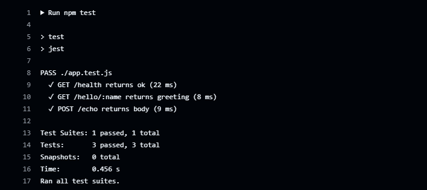
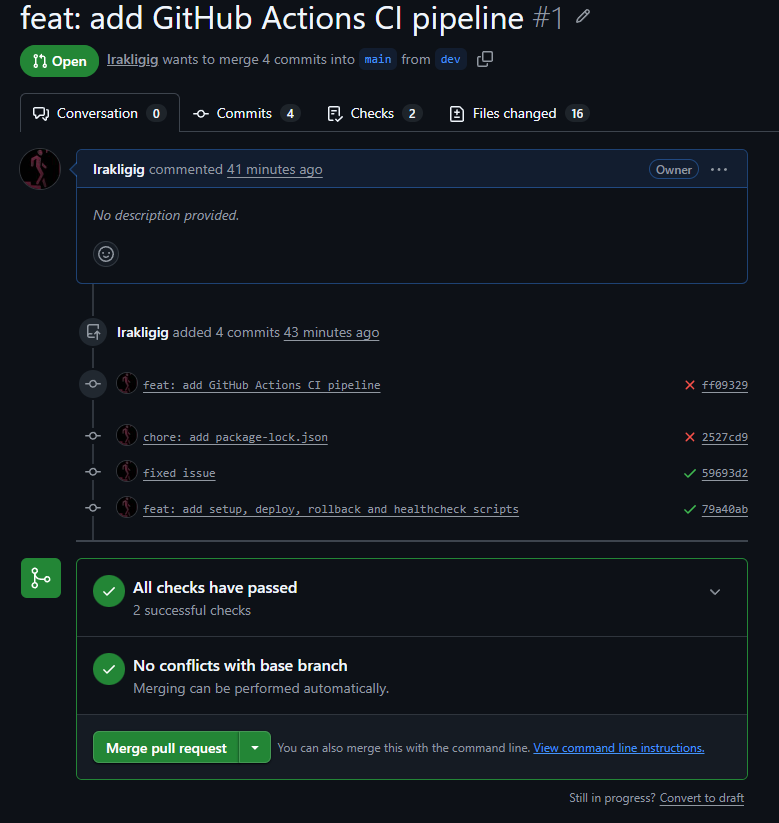
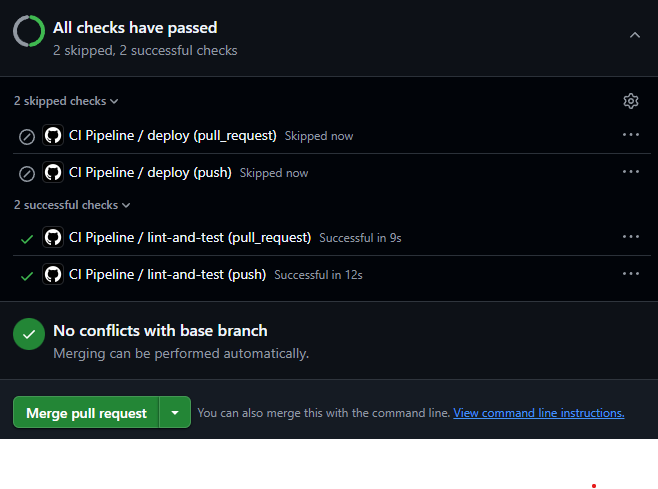
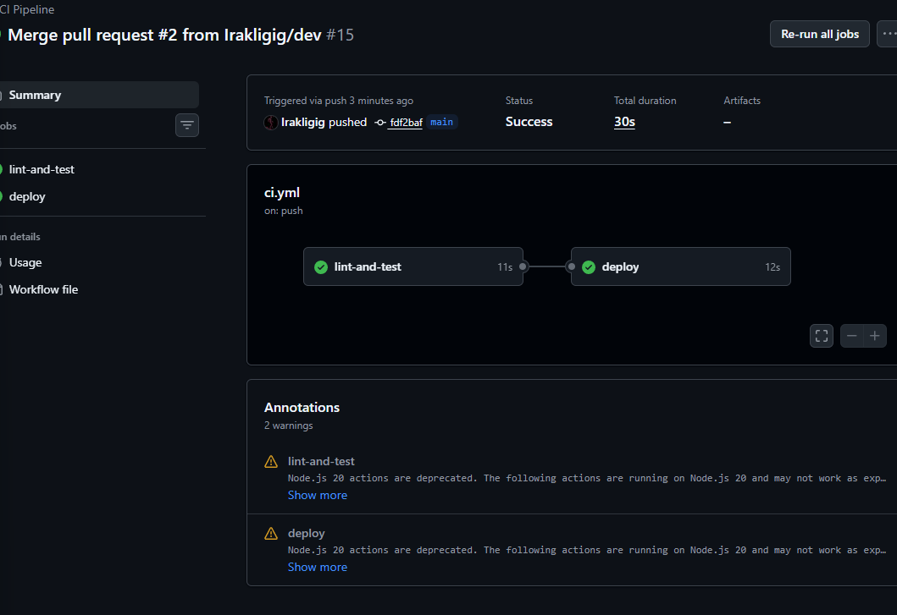
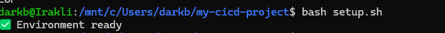
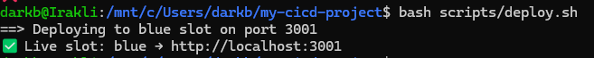
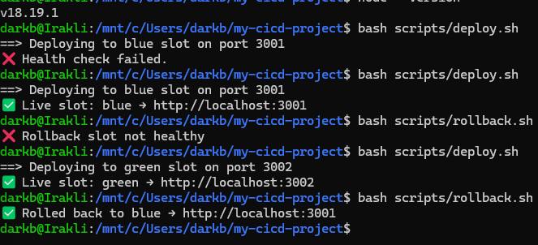
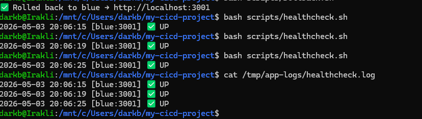

# My CI/CD Project

A minimal Node.js/Express web application demonstrating a complete CI/CD pipeline with automated testing, Blue-Green deployment, and health monitoring.

---

## Tech Stack

| Layer | Tool |
|---|---|
| Web App | Node.js 20, Express 4 |
| Testing | Jest, Supertest |
| Linting | ESLint |
| CI/CD | GitHub Actions |
| IaC | Bash (setup.sh) + Ansible (provision.yml) |
| Deployment Strategy | Blue-Green (Bash scripts) |
| Monitoring | Bash health check script |
| Version Control | Git (main, dev branches) |

---

## Workflow Diagram

```
Push / Pull Request to dev or main
            │
            ▼
┌───────────────────────────┐
│      GitHub Actions       │
│  1. Checkout code         │
│  2. Setup Node.js 20      │
│  3. npm ci                │
│  4. ESLint (lint)         │
│  5. Jest (tests)          │
└────────────┬──────────────┘
             │ all steps pass
             ▼
      Merge PR to main
             │
             ▼
    GitHub Actions deploy job
             │
             ▼
  bash scripts/deploy.sh
  (Blue-Green deployment)
  blue slot (3001) ↔ green slot (3002)
             │
             ▼
  bash scripts/healthcheck.sh
  logs result to /tmp/app-logs/
             │
             ▼
  bash scripts/rollback.sh
  (if needed — switches back instantly)
```

---

## Project Structure

```
my-cicd-project/
├── app.js                    # Express app
├── app.test.js               # Jest unit tests
├── package.json
├── .eslintrc.json
├── setup.sh                  # IaC - single command environment setup
├── .github/
│   └── workflows/
│       └── ci.yml            # GitHub Actions CI/CD pipeline
├── ansible/
│   └── provision.yml         # Ansible provisioning playbook
├── scripts/
│   ├── deploy.sh             # Blue-Green deployment
│   ├── rollback.sh           # Rollback to previous slot
│   └── healthcheck.sh        # Health monitoring script
└── screenshots/              # Proof screenshots
```

---

## Step-by-Step Setup Instructions

### 1. Clone the repository

```bash
git clone https://github.com/Irakligig/my-cicd-project.git
cd my-cicd-project
```

### 2. Run environment setup (IaC — single command)

```bash
bash setup.sh
```

This creates all required log and deployment directories and prepares the environment. Alternatively, if Ansible is available:

```bash
ansible-playbook ansible/provision.yml
```

### 3. Install dependencies

```bash
npm install
```

### 4. Run tests locally

```bash
npm test
```

### 5. Run linting

```bash
npm run lint
```

### 6. Start the application

```bash
npm start
```

App runs at `http://localhost:3000`

Available endpoints:

| Method | Endpoint | Description |
|---|---|---|
| GET | /health | Health check |
| GET | /hello/:name | Dynamic route |
| POST | /echo | Input endpoint |

### 7. Blue-Green Deployment

```bash
bash scripts/deploy.sh
```

Deploys to the idle slot (blue=3001 or green=3002), runs a health check, then switches live traffic to it.

### 8. Rollback

```bash
bash scripts/rollback.sh
```

Switches live traffic back to the previous slot instantly.

### 9. Health Check

```bash
bash scripts/healthcheck.sh
cat /tmp/app-logs/healthcheck.log
```

To schedule it every minute via cron:

```
* * * * * /full/path/to/scripts/healthcheck.sh
```

---

## Git Commit Convention

All commits follow this format:

| Prefix | Meaning |
|---|---|
| `feat:` | New feature |
| `fix:` | Bug fix |
| `chore:` | Maintenance tasks |
| `docs:` | Documentation changes |

---

## Screenshots

### CI Pipeline — Tests Passing



### CI Pipeline — All Checks Passed (PR)



### CI Pipeline — Deploy Job Succeeded



### CI Pipeline — Deploy Job Proof



### IaC Execution (setup.sh)



### Blue-Green Deployment



### Rollback



### Health Check Logs


